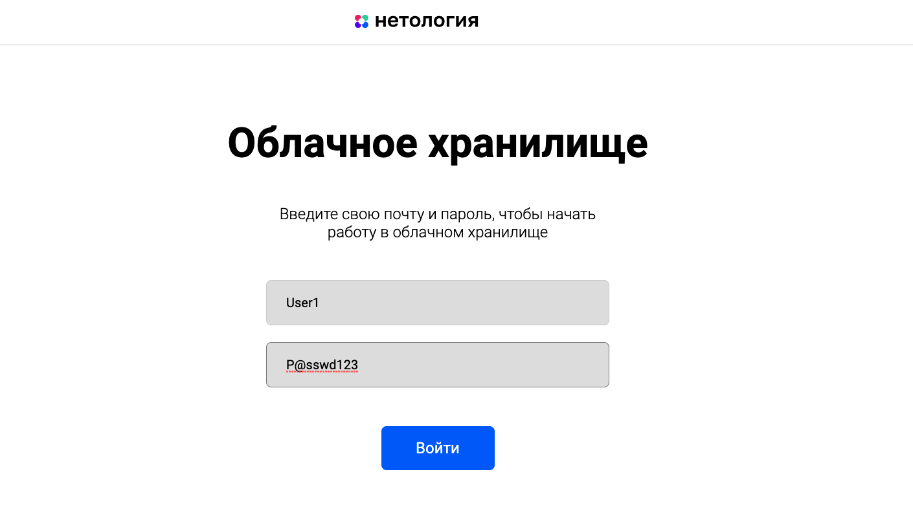
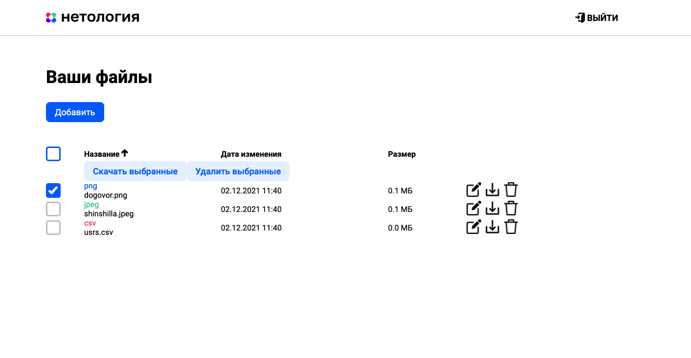

# CloudKeeper (облачное хранилище)

## Особенности реализации:


- **Сервис реализует методы, описанные в** [Спецификации](CloudServiceSpecification.yaml)


- **Приложение разработано с использованием Spring Boot:**

  Сервис предоставляет REST интерфейс для интеграции с [front'ом приложения](frontend/cloudKeeper-frontend).


- **Информация о пользователях и данные пользователей хранятся в базе данных (БД):**

  В проекте используется БД Postgres. БД инициализируется при первом запуске через docker-compose (см. [скрипт инициализации](db_init/init.sql))


- **Реализована аутентификация и другие механизмы разграничения доступа:**

  - [Token-Based Authentication](src/main/java/com/example/CloudKeeper/security),
  - [Spring Security](src/main/java/com/example/CloudKeeper/config/SecurityConfig.java)
  - [CORS](src/main/java/com/example/CloudKeeper/config/MvcConfig.java).


- **Используется сборщик пакетов Maven:**

  См.  [pom.xml](pom.xml).


- **Для запуска используются docker, docker-compose.**

  См.
    - [Dockerfile для front'a](frontend/Dockerfile),
    - [Dockerfile для backend'a](Dockerfile),
    - [Docker-compose скрипт](docker-compose.yml).


- **В приложении реализовано логирование посредством [log4j](src/main/resources/log4j.properties):**

  Логируются основные операции (загрузка/скачивание/переименование файла, вывод списка файлов пользователя, авторизация) и их результаты (уровень INFO), а также ошибки (уровень ERROR),

  Запись лога производится в файл [cloudKeeper-backend.log](log/cloudKeeper-backend.log).


- **Код покрыт unit-тестами с использованием Mockito:**

  Классы тестов расположены в [src/test/java/com/example/CloudKeeper](src/test/java/com/example/CloudKeeper).


- **Реализованы интеграционные тесты с использованием Testcontainers:**

  Класс интеграционных тестов - [src/test/java/com/example/CloudKeeper/container](src/test/java/com/example/CloudKeeper/container).


- **Настройки конфигурации прописаны в файле** [application.yml](src/main/resources/application.yml).

## Запуск:

1. Установите и запустите frontend, следуя [инструкции](frontend/cloudKeeper-frontend/README.md),
2. Убедитесь, что на машине установлен Docker,
3. Осуществите сборку проекта, выполнив команду в терминале:
```
mvn install
```
3. Подготовьте (соберите) образы для запуска backend'a и frontend'a, выполнив в терминале последовательно команды:
```
docker build --file=frontend/Dockerfile  -t cloudkeeper-frontend .

docker build --file=Dockerfile  -t cloudkeeper-app .
```
3. После успешной сборки образов запустите docker-compose скрипт, выполнив команду:

```
docker-compose up
```
4. После успешного запуска будут активны и готовы к использованию:
- backend по адресу http://localhost:8080,
- frontend по адресу http://localhost:8081,
- база данных по адресу http://localhost:5432.

## Использование:
- С описанием и правилами использования front'а можно ознакомиться [здесь](frontend/cloudKeeper-frontend/README.md),

- Для тестирования функционала **рекомендуется использовать преднастроенные учетные данные** (см. логин и пароль, роль пользователя в [скрипте инициализации БД](db_init/init.sql)):

  - **login:** *User1@mail.ru*, **password:** *P@sswd123*
  - **login:** *Elyne@gmail.com*, **password:** *@pplicAtion3313*

## Скриншоты:
<b name="enter">Enter Window:</b>




<b name="enter">Main Window:</b>





